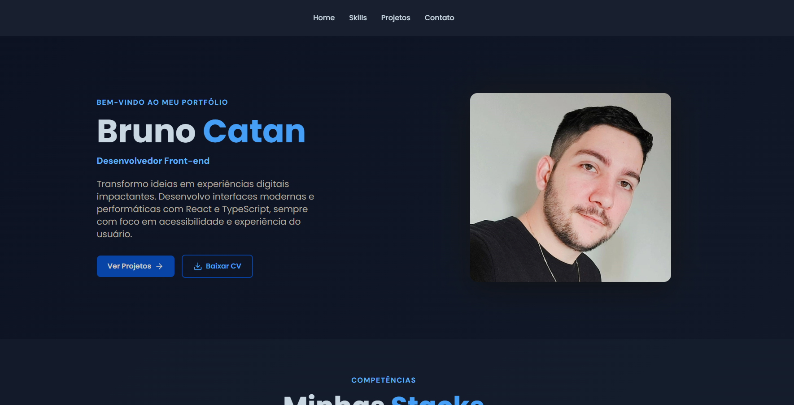

<h1 align="center">🎨 Portfólio | Dev Front-end</h1>

<p align="center">
  Um portfólio profissional e moderno desenvolvido com as tecnologias mais atuais da web
</p>

<p align="center">
  <a href="#-tecnologias">Tecnologias</a>&nbsp;&nbsp;&nbsp;|&nbsp;&nbsp;&nbsp;
  <a href="#-sobre-o-projeto">Sobre</a>&nbsp;&nbsp;&nbsp;|&nbsp;&nbsp;&nbsp;
  <a href="#-features">Features</a>&nbsp;&nbsp;&nbsp;|&nbsp;&nbsp;&nbsp;
  <a href="#-como-usar">Como Usar</a>&nbsp;&nbsp;&nbsp;|&nbsp;&nbsp;&nbsp;
  <a href="#-deploy">Deploy</a>&nbsp;&nbsp;&nbsp;|&nbsp;&nbsp;&nbsp;
  <a href="#-licença">Licença</a>
</p>

<p align="center">
  
  
</p>

<br>

<p align="center">
  
</p>

---

## 🚀 Tecnologias

Este projeto foi desenvolvido com as seguintes tecnologias:

- **Frontend Framework**: React 18+ com TypeScript
- **Build Tool**: Vite
- **Styling**: Tailwind CSS 3 (utility-first CSS)
- **UI Components**: React Icons
- **Smooth Scrolling**: scroll-to-element
- **Package Manager**: npm
- **Code Quality**: ESLint, TypeScript strict mode

## 💻 Sobre o Projeto

Um portfólio profissional responsivo e moderno que showcaseia projetos, habilidades técnicas e fornece formas de contato. Redesenhado com foco em **design limpo**, **performance** e **experiência do usuário**.

### ✨ Features Principais

- ✅ **Design Responsivo** - Funciona perfeitamente em mobile, tablet e desktop
- ✅ **Animações Suaves** - Transições elegantes e fade-ins ao scrollar
- ✅ **Navbar Moderna** - Menu fixo com dropdown mobile e smooth scroll
- ✅ **Seção About** - Apresentação pessoal com CTA buttons e stats
- ✅ **Skills Organizadas** - Skills agrupadas por categoria (Frontend, Framework, CSS, Tools)
- ✅ **Galeria de Projetos** - Cards interativos com links para deploy e repositório
- ✅ **Seção de Contato** - Links para redes sociais e formas de comunicação
- ✅ **Botão "Voltar ao Topo"** - Aparece ao fazer scroll com animação
- ✅ **Performance Otimizada** - CSS Modules e code splitting com Vite
- ✅ **Acessibilidade** - HTML semântico e labels ARIA

## 🎨 Design & UX

- Paleta de cores profissional (azul e gradientes)
- Tipografia clara com Poppins e DM Sans
- Espaçamento consistente com Tailwind
- Modo claro mantendo elegância
- Feedback visual em hover states
- Animações suaves com CSS transforms

## 📦 Como Usar

### Pré-requisitos

- Node.js 16+ instalado
- npm ou yarn

### Instalação

```bash
# Clone o repositório
git clone https://github.com/BrunoCatan/portfolio.git

# Entre no diretório
cd portfolio

# Instale as dependências
npm install
```

### Desenvolvimento

```bash
# Inicie o servidor de desenvolvimento
npm run dev

# Acesse http://localhost:5173
```

### Build para Produção

```bash
# Crie a build otimizada
npm run build

# Visualize a build localmente
npm run preview
```

## 🌐 Deploy

O portfólio está publicado em: **[bruno.cortextechnology.com.br](https://bruno.cortextechnology.com.br/)**

## 📁 Estrutura do Projeto

```
portfolio/
├── src/
│   ├── components/          # Componentes React
│   │   ├── About/          # Seção de apresentação
│   │   ├── Skills/         # Seção de habilidades
│   │   ├── Projects/       # Galeria de projetos
│   │   ├── MyProjects/     # Header de projetos
│   │   ├── Navbar/         # Navegação
│   │   ├── Footer/         # Rodapé
│   │   └── ButtonTop/      # Botão voltar ao topo
│   ├── styles/
│   │   └── global.css      # Tailwind + estilos globais
│   ├── App.tsx             # Componente raiz
│   └── main.tsx            # Entrada da aplicação
├── public/                 # Arquivos estáticos
├── tailwind.config.js      # Configuração Tailwind
├── tsconfig.json           # Configuração TypeScript
├── vite.config.ts          # Configuração Vite
└── package.json            # Dependências
```

## 🔧 Configuração

### Tailwind CSS

Customizações de cores, animações e fontes em `tailwind.config.js`:

```javascript
theme: {
  extend: {
    colors: {
      primary: "#1e293b",
      secondary: "#0f172a",
      accent: "#3b82f6",
    },
    animation: {
      fadeIn: "fadeIn 0.8s ease-in",
      slideUp: "slideUp 0.8s ease-out",
    }
  }
}
```

## 📊 Performance

- **Vite** para builds ultrarrápidas
- **Code Splitting** automático
- **Lazy Loading** de componentes
- **Tailwind CSS** tree-shaking para CSS mínimo
- Otimização de imagens
- FontFace preload

## 🤝 Contribuindo

Sugestões e melhorias são bem-vindas! Sinta-se livre para:

1. Fazer um fork do projeto
2. Criar uma branch para sua feature (`git checkout -b feature/amazing`)
3. Commit suas mudanças (`git commit -m 'Add amazing feature'`)
4. Push para a branch (`git push origin feature/amazing`)
5. Abrir um Pull Request

## 📝 Licença

Este projeto está sob a licença **MIT**. Veja o arquivo [LICENSE](LICENSE) para mais detalhes.

---

<div align="center">
  <h3>🚀 Desenvolvido por <a href="https://brunocatan.dev/">Bruno Catan</a></h3>
  
  <a href="https://www.linkedin.com/in/brunocatan/" target="_blank">
    
  </a>
  &nbsp;&nbsp;
  <a href="https://wa.me/+5517992817472" target="_blank">
    
  </a>
  &nbsp;&nbsp;
  <a href="https://github.com/brunocatan" target="_blank">
    
  </a>
  &nbsp;&nbsp;
  <a href="mailto:bruno@cortextechnology.com.br" target="_blank">
    
  </a>

  <p><strong>☕ Feito com ❤️ usando React + TypeScript + Tailwind CSS</strong></p>
</div>
